# 🚀 Voice Agent Optimization Guide

## 📐 Overall System Architecture

Before diving into optimizations, let's understand the complete architecture of this voice agent system.

### High-Level Architecture Overview

This system implements a **Multi-Modal AI Voice Agent** using a **Tool-First Architecture** where:
- **Frontend (React)** = The "Body" (senses & actions)
- **Backend (FastAPI)** = The "Memory" (database & logic)
- **Gemini AI** = The "Brain" (intelligence & orchestration)


---

### Component Architecture (Detailed)


---

### Technology Stack


---

### Data Flow: Complete Request Lifecycle

```mermaid
sequenceDiagram
    participant U as 👤 User
    participant B as Browser<br/>(React)
    participant W as WebSocket
    participant G as Gemini AI
    participant API as Backend API
    participant DB as Database
    
    Note over U,DB: 1. INITIALIZATION PHASE
    B->>API: GET /api/products/recommendations
    API->>DB: Load cached data
    DB-->>API: Return products
    API-->>B: JSON Response
    B->>B: Render Dashboard
    
    Note over U,DB: 2. CONVERSATION START
    U->>B: Click "Start Agent"
    B->>W: Connect WebSocket
    W->>G: Initialize Session<br/>(System Prompt + Tools)
    G-->>W: Connection Established
    W-->>B: Ready
    
    Note over U,DB: 3. USER SPEECH
    U->>B: 🎤 "I need wireless headphones"
    B->>B: Capture Audio (PCM)
    B->>W: Stream Audio Chunks
    W->>G: Real-time Audio Input
    
    Note over U,DB: 4. AI REASONING
    G->>G: Speech-to-Text<br/>Intent Recognition
    G->>G: Decision: Use Tool<br/>"search_products"
    G->>W: Tool Call Message<br/>{query: "wireless headphones"}
    W->>B: Tool Request
    
    Note over U,DB: 5. TOOL EXECUTION
    B->>API: GET /api/products/search?q=wireless+headphones
    API->>DB: Keyword Search
    DB-->>API: [Product A, Product B...]
    API->>DB: Vector Search (if needed)
    DB-->>API: [Product C, Product D...]
    API->>API: Merge & Filter Results
    API-->>B: JSON Product List
    
    Note over U,DB: 6. UI UPDATE
    B->>B: Update State<br/>mode: 'PRODUCT_LIST'
    B->>B: Render Product Cards
    
    Note over U,DB: 7. CONTEXT RETURN
    B->>W: Tool Result JSON
    W->>G: Function Response
    G->>G: Generate Natural Response
    G->>W: Audio Stream (PCM)
    W->>B: Audio Chunks
    
    Note over U,DB: 8. VOICE OUTPUT
    B->>B: Decode & Queue Audio
    B->>U: 🔊 "I found 5 wireless headphones..."
```



---

### Architecture Principles

#### 1. **Separation of Concerns**
- **Frontend**: Handles presentation and user interaction only
- **Backend**: Manages all business logic and data persistence
- **AI**: Orchestrates workflow and generates natural language

#### 2. **Single Source of Truth**
- Backend database is the **only** authoritative data source
- Frontend **never** stores or caches product/order data long-term
- AI model has **zero** product knowledge without tool calls

#### 3. **Real-time Synchronization**
- WebSocket enables bidirectional streaming (not request/response)
- Audio chunks flow continuously in both directions
- Tool calls are processed asynchronously without blocking audio

#### 4. **Hybrid Search Strategy**
```
User Query → Keyword Search (Fast) 
           ↓
    Found enough? → Yes → Return Results
           ↓ No
    Vector Search (Semantic)
           ↓
    Merge & Deduplicate
           ↓
    Return Combined Results
```

#### 5. **Cost-Aware Design**
- Compression: Minimize JSON payload sizes
- Streaming: Process audio in small chunks (not full files)
- Caching: Frontend caches UI state, not product data
- Selective VAD: Only send audio when user is speaking

---

### File Structure & Responsibilities

```
Voice Agent/
├── Frontend (React)
│   ├── App.tsx                    # Main app, state management
│   ├── services/
│   │   ├── geminiLiveService.ts  # WebSocket handler
│   │   ├── tools.ts              # Tool definitions & executor
│   │   ├── mockData.ts           # API client (HTTP calls)
│   │   └── prompts.ts            # System instruction template
│   └── components/               # UI components
│
├── Backend (Python)
│   ├── main.py                   # FastAPI routes
│   ├── data_loader.py            # JSON file I/O
│   ├── search_logic.py           # Hybrid search logic
│   └── vector_search.py          # Embedding & similarity
│
└── Files/ (Data)
    ├── product_catalog.json      # Products (structured)
    ├── order_database.json       # Orders (structured)
    ├── product_faqs.json         # FAQs (semi-structured)
    └── Company_policies.md       # Policies (unstructured)
```

---

### Request Cost Breakdown (Per Interaction)


**Typical 5-minute Session Cost**: ~$0.03
- Audio Input: ~$0.006 (3 mins active speech)
- Audio Output: ~$0.012 (3 mins AI speaking)
- Tool Tokens: ~$0.008 (10 tool calls)
- System Prompt: ~$0.0001 (one-time)

---

## 💰 Optimization Strategies

Now that you understand the architecture, here are targeted optimizations for each component:

This guide provides actionable strategies to reduce costs and improve performance of your voice agent.

---

## 💰 Cost Optimization Strategies

### 1. **Optimize System Prompt Length**
**Current Impact**: ~$0.0001 per session startup

**Strategy**: Compress your system instruction while maintaining clarity.

```typescript
// ❌ Verbose (Current)
"You are the dedicated AI Sales and Support Agent for 'NeurologicAI Store'..."

// ✅ Compressed
"Role: NeurologicAI Store AI Agent. Use tools for all product/order queries..."
```

**Savings**: ~40-60% reduction in prompt tokens (from ~1000 to ~400 chars)

---

### 2. **Reduce Tool Response Payload Size**
**Current Impact**: $0.10 per 1M input tokens

**Strategy**: Return only essential fields from backend APIs.

```python
# ❌ Full Product Object (backend/search_logic.py)
return full_product  # ~500 chars per product

# ✅ Minimal Product Object
return {
    "id": p["id"],
    "name": p["name"],
    "price": p["price"],
    "stock": p["stock"]
}  # ~100 chars per product
```

**Implementation**:
```python
# In search_logic.py
def search_products(self, query=None, category=None):
    results = self._keyword_search(query, category)
    # Return minimal fields for list view
    return [{
        "id": r["id"],
        "name": r["name"],
        "price": r["price"],
        "stock": r["stock"],
        "rating": r.get("rating", 0)
    } for r in results]
```

**Savings**: ~80% reduction in tool response tokens

---

### 3. **Implement Response Caching**
**Strategy**: Cache frequently accessed data on the frontend.

```typescript
// In mockData.ts
const CACHE: Map<string, { data: any, timestamp: number }> = new Map();
const CACHE_TTL = 60000; // 1 minute

export const db = {
    searchProducts: async (query?: string, category?: string) => {
        const cacheKey = `search_${query}_${category}`;
        const cached = CACHE.get(cacheKey);
        
        if (cached && Date.now() - cached.timestamp < CACHE_TTL) {
            return cached.data;
        }
        
        const data = await fetch(...);
        CACHE.set(cacheKey, { data, timestamp: Date.now() });
        return data;
    }
}
```

**Savings**: Reduces redundant API calls by ~30-50%

---

### 4. **Use Text-Only Mode for Non-Critical Interactions**
**Current**: Audio I/O costs ~$0.36/hour combined

**Strategy**: Switch to text mode for browsing/comparison tasks.

```typescript
// Add mode toggle in App.tsx
const [audioMode, setAudioMode] = useState(true);

// In GeminiLiveService
config: {
    responseModalities: audioMode ? [Modality.AUDIO] : [Modality.TEXT]
}
```

**Savings**: ~90% cost reduction during text-only sessions

---

### 5. **Implement Voice Activity Detection (VAD) Threshold Tuning**
**Current**: Sends all audio chunks (even silence)

**Strategy**: Only send audio when speech is detected.

```typescript
// In geminiLiveService.ts - startAudioInput
processor.onaudioprocess = (e) => {
    const inputData = e.inputBuffer.getChannelData(0);
    const rms = calculateRMS(inputData);
    
    // ✅ Only send if speech detected
    if (rms > SPEECH_THRESHOLD) {
        const pcmBlob = createPcmBlob(inputData);
        session.sendRealtimeInput({ media: pcmBlob });
    }
    // Silence is NOT sent, saving ~50% of audio input costs
};
```

**Savings**: ~40-60% reduction in audio input costs

---

### 6. **Batch Tool Calls**
**Strategy**: Combine related tool calls into single requests.

```typescript
// ❌ Sequential Calls
await db.getProductById(id);
await db.getProductFaqs(id);
await db.getRelatedProducts(id);

// ✅ Batch Endpoint
await db.getProductDetails(id); // Returns all in one call
```

**Backend Implementation**:
```python
@app.get("/api/products/{product_id}/full")
def get_full_product_details(product_id: str):
    return {
        "product": data.get_product(product_id),
        "faqs": data.get_faqs(product_id),
        "related": search_engine.get_related_products(product_id)
    }
```

**Savings**: Reduces latency by ~200-400ms and token overhead

---

## ⚡ Performance Optimization

### 7. **Use Streaming for Long Responses**
**Current**: Waits for complete audio before playing

**Strategy**: Already implemented! Your current setup streams audio chunks.

✅ **Already Optimized**: Your `playAudio` function queues chunks progressively.

---

### 8. **Optimize Vector Search**
**Current**: Full embedding search on every query

**Strategy**: Add keyword pre-filter before vector search.

```python
# In search_logic.py
def search_products(self, query=None, category=None):
    # ✅ Fast keyword filter first
    keyword_results = self._keyword_search(query, category)
    
    if len(keyword_results) >= 5:
        return keyword_results  # Skip expensive vector search
    
    # Only use vector search if needed
    semantic_results = self._semantic_search(query)
    return keyword_results + semantic_results
```

**Savings**: ~70% faster search for common queries

---

### 9. **Lazy Load Vector Database**
**Strategy**: Only initialize vector DB when semantic search is needed.

```python
# In data_loader.py
def __init__(self):
    self.vector_db = None  # Don't initialize yet
    
def get_vector_db(self):
    if self.vector_db is None:
        self.vector_db = VectorSearch(...)
        self.vector_db.index_products(self.products)
    return self.vector_db
```

**Savings**: ~2-3 seconds faster backend startup

---

### 10. **Implement Tool Result Summarization**
**Strategy**: Let the model summarize instead of returning full JSON.

```typescript
// In tools.ts - executeTool
case 'search_products': {
    const products = await db.searchProducts(args.query, args.category);
    
    // ✅ Return summary instead of full objects
    result = {
        count: products.length,
        summary: products.slice(0, 3).map(p => 
            `${p.name} ($${p.price})`
        ).join(', '),
        ids: products.map(p => p.id)  // For follow-up queries
    };
}
```

**Savings**: ~60% reduction in tool response tokens

---

## 📊 Cost Comparison Table

| Optimization | Current Cost/Hour | Optimized Cost/Hour | Savings |
|-------------|-------------------|---------------------|---------|
| **Baseline** | $0.40 | - | - |
| + Compressed Prompt | $0.38 | $0.02 | 5% |
| + Minimal Payloads | $0.30 | $0.10 | 25% |
| + VAD Tuning | $0.22 | $0.18 | 45% |
| + Text Mode (when possible) | $0.08 | $0.32 | 80% |
| **All Combined** | $0.40 | **$0.12** | **70%** |

---

## 🎯 Quick Wins (Implement First)

1. ✅ **Compress System Prompt** (5 min) - 5% savings
2. ✅ **Minimal Tool Responses** (15 min) - 25% savings
3. ✅ **VAD Threshold Tuning** (10 min) - 20% savings

**Total Quick Win**: ~50% cost reduction in 30 minutes of work

---

## 🔧 Advanced Optimizations

### 11. **Use Gemini Flash Instead of Pro**
Already using Flash ✅ - This is the most cost-effective model.

### 12. **Implement Session Timeout**
Auto-disconnect after 5 minutes of inactivity to prevent idle costs.

### 13. **Pre-compute Common Queries**
Cache responses for "What are your return policies?" type questions.

---

## 📈 Monitoring & Iteration

Track these metrics to measure optimization impact:

```typescript
// Add to App.tsx metrics
metrics: {
    totalCost: 0,
    costPerHour: 0,
    avgToolResponseSize: 0,  // NEW
    cacheHitRate: 0,         // NEW
    audioSilenceRatio: 0     // NEW
}
```

**Goal**: Achieve <$0.15/hour for typical shopping sessions.
