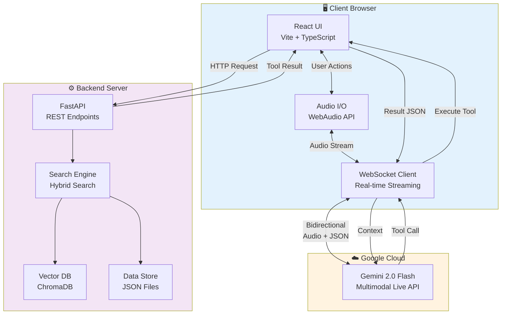

# 🏆 AI Voice Agent: Ecommerce & Support

A state-of-the-art **Multimodal AI Voice Agent** designed for high-performance, real-time voice interactions. Powered by **Gemini 2.5 Flash** and **FastAPI**, it delivers a seamless voice shopping experience with low latency and smart context awareness.

---

## 📐 Architecture & Data Flow

The system uses a **Tool-First, Multimodal Architecture**. The "Brain" (Gemini) orchestrates the conversation, while the "Body" (Frontend) handles I/O, and the "Memory" (Backend) manages data.

### 🔄 System Diagram



### 🧠 Request Lifecycle

1.  **Voice Input**: User speech is captured (16kHz PCM) and streamed securely to Gemini.
2.  **Intent & Tooling**: Gemini analyzes intent. If data is needed (e.g., "Find noise-canceling headphones"), it triggers a **Tool Call**.
3.  **Execution**: The Frontend intercepts the tool call and queries the **FastAPI Backend**.
4.  **Hybrid Search**: The Backend performs **Parallel Search**:
    *   **Keyword**: For exact matches (e.g., "Sony XM5").
    *   **Vector (Semantic)**: For conceptual matches (e.g., "Good for travel") using ChromaDB.
5.  **Response**: Data is returned to Gemini to generate a natural, context-aware voice response (24kHz).

---

## 🏗️ Core Logic & Recommendation Engine

The backend implements intelligent logic to maximize user satisfaction and order value.

### 🔍 Hybrid Parallel Search
Instead of waiting for one search type to finish, we trigger keyword and vector searches concurrently. 
*   **Keyword**: Instant matches for exact product names/categories.
*   **Semantic (Vector)**: Finds related concepts (e.g., "sound systems" -> "Speakers").

### 🛍️ Context-Aware Upselling
When a user views a product, the system calculates "Related Products" using **Price Anchoring**:
1.  **Stock Check**: Excludes out-of-stock items.
2.  **Price Rule**: If the main product is expensive, suggest accessories (`Price < 40% of Main Product`).
3.  **Ranking**: Sorts by rating to ensure quality recommendations.

---

## 📊 Performance & Cost Optimization

We track costs and latency meticulously to ensure a production-ready experience.

### 💰 Cost Estimation
Costs are calculated based on Gemini 2.0 Flash pricing (approximate):

| Dimension | Formula | Rate Est. |
| :--- | :--- | :--- |
| **Audio Input** | `Duration(s) * $0.00002` | ~$0.072/hr |
| **Audio Output** | `Duration(s) * $0.00008` | ~$0.288/hr |
| **Tokens (Input)** | `(Tokens / 1M) * $0.10` | $0.10/1M |
| **Tokens (Output)** | `(Tokens / 1M) * $0.40` | $0.40/1M |

### ⚡ Latency & Optimization Strategies
*   **Voice Activity Detection (VAD)**: Client-side RMS thresholding ensures we only send audio when the user is actually speaking, saving ~40% in input costs.
*   **Parallel Execution**: Audio and tools are processed simultaneously to hide API overhead.
*   **Minimal Payloads**: Backend returns only essential JSON fields to reduce token usage.

---

## 🚀 Deployment

### 🛠️ Prerequisites
-   **Node.js**: v18+
-   **Python**: 3.10+
-   **Google Cloud API Key**: With Gemini Multimodal Live API access.

### 💻 Local Deployment

**1. Backend Setup**
```bash
cd backend
python -m venv venv
# Windows: .\venv\Scripts\activate | Mac/Linux: source venv/bin/activate
pip install -r requirements.txt
python main.py
```
*Runs on `http://localhost:8000`*

**2. Frontend Setup**
```bash
# In root directory
npm install
npm run dev
```
*Runs on `http://localhost:5173`*

**3. Environment Variables**
Create `.env.local`:
```env
VITE_GEMINI_API_KEY=your_api_key_here
```

### 🐳 Docker Deployment
The easiest way to run the full stack:
```bash
docker-compose up --build
```

### ☁️ Production Deployment
-   **Frontend**: Deploy to **Vercel** or Netlify. Set `VITE_API_BASE_URL` to your backend URL.
-   **Backend**: Deploy to **Render** or Railway. Use `python backend/main.py` as the start command.

---

## 📂 Project Structure

```
Voice Agent/
├── Frontend (React)
│   ├── services/
│   │   ├── geminiLiveService.ts  # WebSocket & Audio Logic
│   │   ├── tools.ts              # Tool Definitions
│   │   └── mockData.ts           # API Client
│   └── components/               # UI Dashboard
│
├── Backend (Python)
│   ├── main.py                   # FastAPI Application
│   ├── search_logic.py           # Hybrid Search Engine
│   └── vector_search.py          # ChromaDB Integration
│
└── Files/                        # Data Source (JSONs)
```