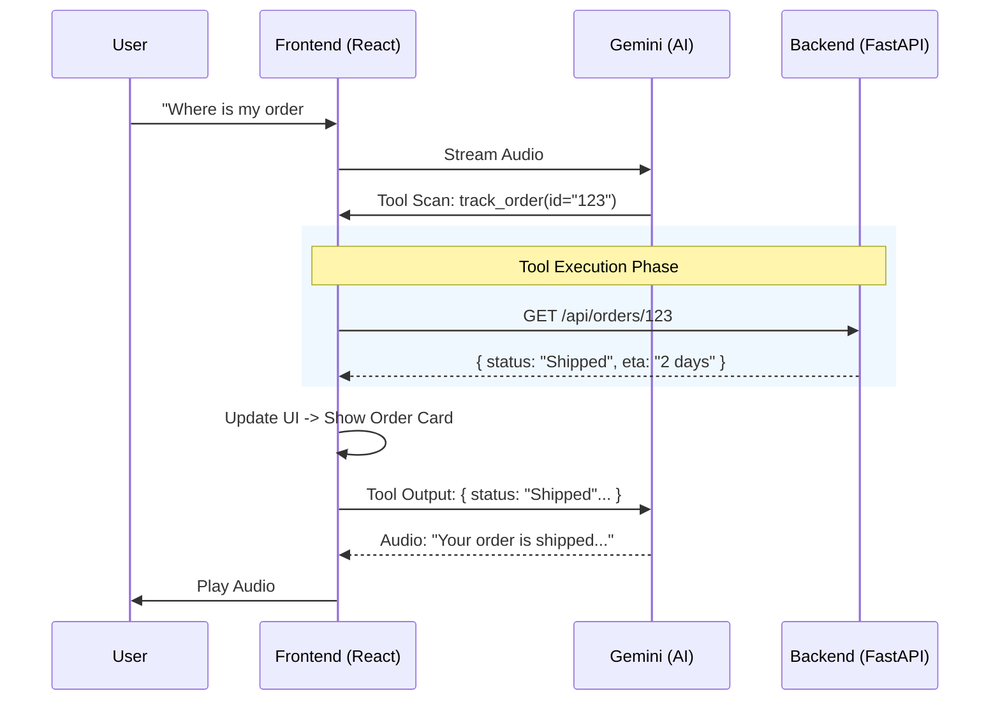

# 🎙️ NeurologicAI Store - Multi-Modal Voice Agent

A sophisticated e-commerce voice agent that combines **real-time bidirectional audio**, **tool usage**, and a **vector-powered backend** to provide an intelligent shopping experience.

---

## 🏗️ Architecture

The system follows a modern **Tool-First Agentic Architecture** where the frontend is the "Body" (senses & actions), the Backend is the "Memory" (database), and Gemini is the "Brain".

```mermaid
graph TD
    User((👤 User))
    
    subgraph Frontend ["🖥️ Frontend (React + Vite)"]
        Audio[Audio Only]
        UI[Visual Interface]
        Tools[Tool Executor]
        Socket[WebSocket Client]
    end

    subgraph Brain ["🧠 Intelligence (Google Cloud)"]
        Gemini[✨ Gemini 2.0 Flash]
    end

    subgraph Backend ["⚙️ Backend (FastAPI)"]
        API[REST API]
        VectorDB[Vector Search (Chroma/Faiss)]
        SQL[Data Store (JSON/DB)]
    end

    User <-->|Microphone/Speaker| Audio
    User <-->|Visuals| UI
    
    Audio -->|Audio Stream| Socket
    Socket <-->|Real-time Audio & Tools| Gemini
    
    Gemini -->|1. Tool Call| Socket
    Socket -->|2. Execute| Tools
    Tools <-->|3. Fetch Data| API
    
    API <--> SQL
    API <--> VectorDB
    
    Tools -->|4. Tool Result| Socket
    Socket -->|5. Context Update| Gemini
    Gemini -->|6. Natural Response| Audio
```

### Components

1.  **Frontend (React + TypeScript)**:
    *   **Role**: Handles user interaction, audio streaming, and tool execution.
    *   **Key Service**: `GeminiLiveService.ts` manages the WebSocket connection to Google's Multimodal Live API.
    *   **State Management**: Updates the UI dynamically based on the AI's actions (e.g., showing a product when the AI "finds" it).

2.  **Backend (FastAPI + Python)**:
    *   **Role**: The "Single Source of Truth". Manages products, orders, and policies.
    *   **Vector Search**: Uses embeddings to allow "Semantic Search" (e.g., searching for "something for gaming" finds a high-spec laptop even if the word 'gaming' isn't in the title).
    *   **Data Persistence**: Reads/Writes to JSON files (`Files/` directory) acting as a database.

3.  **AI Model (Gemini 2.0 Flash)**:
    *   **Role**: The Orchestrator. It listens to audio, decides *when* to use tools (like searching for a product), and allows the frontend to execute them.

---

## 🔄 How it Works

### ⚡ Detailed Breakdown
1.  **Initialization**:
    *   When the app starts, the Frontend fetches the `System Context` (current user ID, available categories) from the Backend to prime the AI's prompts.
    
2.  **The Conversation Loop**:
    *   **User Speaks**: "I need a headphone for running."
    *   **Streaming**: The audio is streamed chunk-by-chunk to Gemini via WebSocket.
    *   **Intent Recognition**: Gemini analyses the audio in real-time. It recognizes the intent is **shopping search**.
    
3.  **Tool Execution Strategy**:
    *   Gemini pauses generation and sends a **Tool Call** message: `search_products(query="headphone", category="running")`.
    *   The **Frontend intercepts** this message. It does *not* generate audio yet.
    *   The Frontend calls the **Backend API** (`GET /api/products/search`).
    
4.  **Backend Intelligence**:
    *   The Backend receives the query.
    *   It performs a **Hybrid Search**:
        *   *Keyword*: Checks for exact matches.
        *   *Vector*: Checks for semantic matches (understanding that "running" implies "sweat-proof" or "secure fit").
    *   It returns a list of JSON products.

5.  **Closing the Loop**:
    *   The Frontend sends this JSON data back to Gemini as a **Tool Response**.
    *   Gemini "reads" the results and generates a natural voice response: *"I found a few great options. The SportBuds Pro are perfect for running..."*
    *   Simultaneously, the Frontend **updates the UI** to display the product cards visually.

### 📝 Concise Summary
*   **User** speaks.
*   **Gemini** hears and creates a *Function Call*.
*   **React** executes the function by calling the **Python Backend**.
*   **Backend** returns real data.
*   **Gemini** uses that data to answer the user.
*   **Screen** updates automatically to show what is being discussed.

---

## 📊 Logic Flowchart



---

## 🚀 Setup & Installation

### Prerequisites
*   **Node.js** (v18+)
*   **Python** (v3.10+)
*   **Google Gemini API Key** (Multimodal Live API access required)

### 1. Backend Setup
The backend serves the data and handles logic.

```bash
cd backend
# Create virtual environment
python -m venv venv
# Activate (Windows)
.\venv\Scripts\activate
# Activate (Mac/Linux)
# source venv/bin/activate

# Install dependencies
pip install fastapi uvicorn sentence-transformers chromadb numpy

# Run the server
python main.py
```
*Server runs at `http://localhost:8000`*

### 2. Frontend Setup
The visual interface and AI connection.

```bash
# In the root directory
npm install

# Create .env.local file
echo "VITE_GEMINI_API_KEY=your_api_key_here" > .env.local

# Run the dev server
npm run dev
```
*App runs at `http://localhost:5173`*

### 3. Usage
1.  Open the localhost URL in Chrome/Edge.
2.  Click **"Start Agent"**.
3.  Speak naturally! Try:
    *   *"Show me some gaming laptops."*
    *   *"Which one is cheaper?"*
    *   *"Add the first one to my cart."*
    *   *"What is your return policy?"*